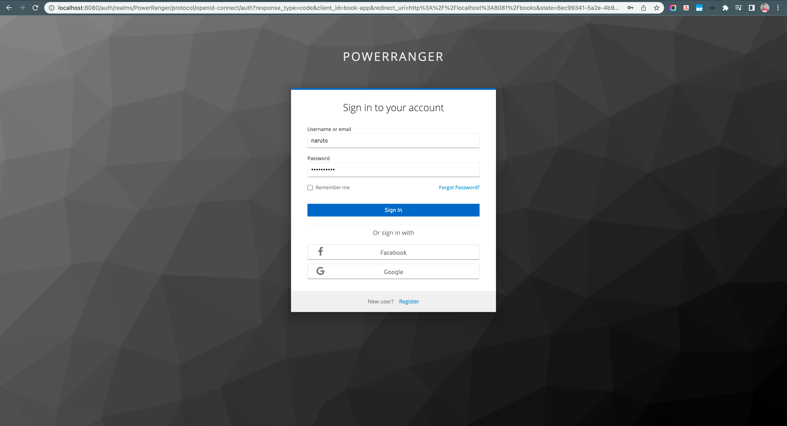
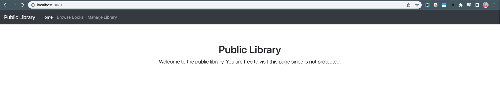
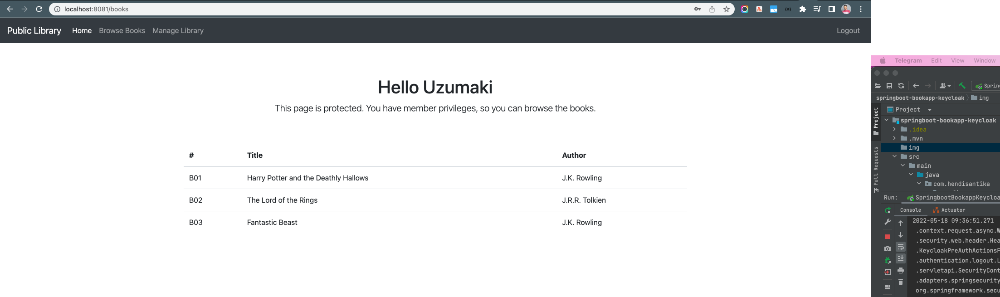
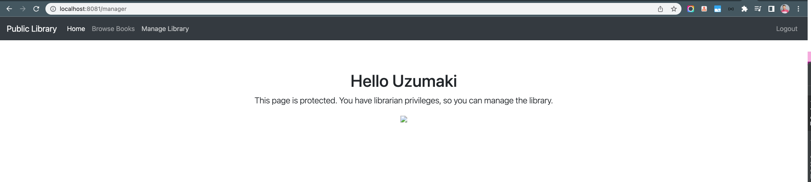
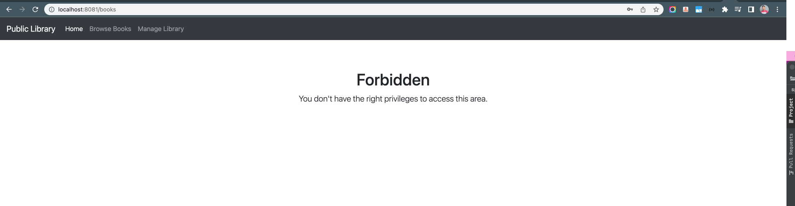

# Spring Security and Keycloak to Secure a Spring Boot Application

### Things todo list:

1. Clone this repository: `git clone https://github.com/hendisantika/springboot-bookapp-keycloak.git`
2. Navigate to the folder: `cd springboot-bookapp-keycloak`
3. Run keycloak container using docker compose 'docker compose up'
4. Import keycloak realm file
5. Run the application: `mvn clean spring-boot:run`
6. Open your favorite browser: http://localhost:8081

### Image Screen shot

Keycloak Login Page

Home Page

List Books Page

Manager Page

Forbidden Page

